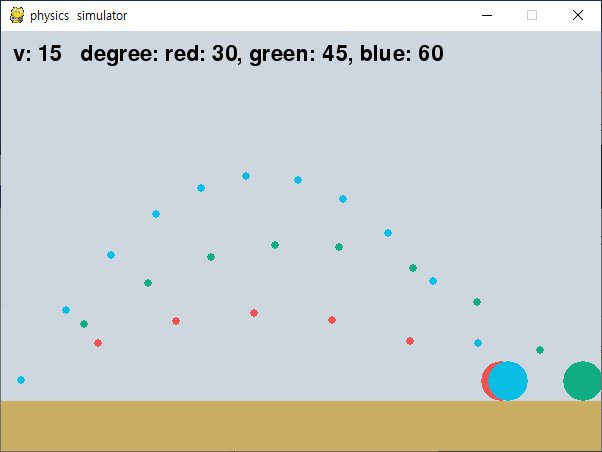

# Highschool projects
## Projectile motion
- 각도와 속력에 따른 공 중력 시뮬레이션

- 30도, 45도, 60도로 투사체를 던졌을 때의 자취를 표시한다.
- 예상: 30도와 60도의 수평 이동거리가 같고, 45도가 가장 멀리 날아간다.
- 결과: 30도와 60도의 수평 이동거리가 비슷하고, 45도가 가장 멀리 날아간다.
- 오차: 물체와 땅의 충돌 처리시 물체가 땅에 들어간만큼 수직으로 위로 올렸다. 속도가 달라 땅에 들어간 위치가 달랐을 것이다.

## Education projects
- 교육과정에 있는 여러 지식들을 확인 또는 응용해보자.

|번호|활동|날짜|
|---|---|---|
|1|[이항분포를 원 그래프로 확인해보자.](https://github.com/khhandrea/educationProjects/blob/master/binomial.ipynb "github")|2020-03-05|
|2|[이항분포와 정규분포 사이의 관계를 확인해보자.](https://github.com/khhandrea/educationProjects/blob/master/binomial2normal.ipynb "github")|2020-03-06|
|3|[각도에 따른 포물선 운동의 궤적을 확인해보자.](https://github.com/khhandrea/educationProjects/blob/master/projectileMotion.ipynb "github")|2020-03-07|

