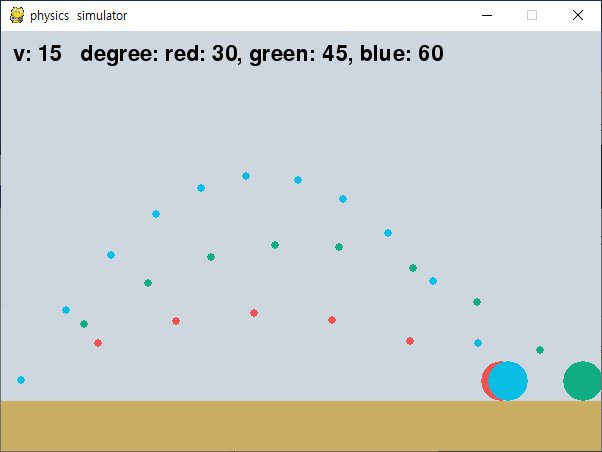

# projectileMotion
각도와 속력에 따른 공 중력 시뮬레이션

## 프로그램 사진

#### 30도, 45도, 60도로 투사체를 던졌을 때의 자취를 표시한다.

## 예상
#### 30도와 60도의 수평 이동거리가 같고, 45도가 가장 멀리 날아간다.

## 결고
#### 30도와 60도의 수평 이동거리가 비슷하고, 45도가 가장 멀리 날아간다.

## 오차
#### 물체와 땅의 충돌 처리시 물체가 땅에 들어간만큼 수직으로 위로 올렸다. 속도가 달라 땅에 들어간 위치가 달랐을 것이다.
